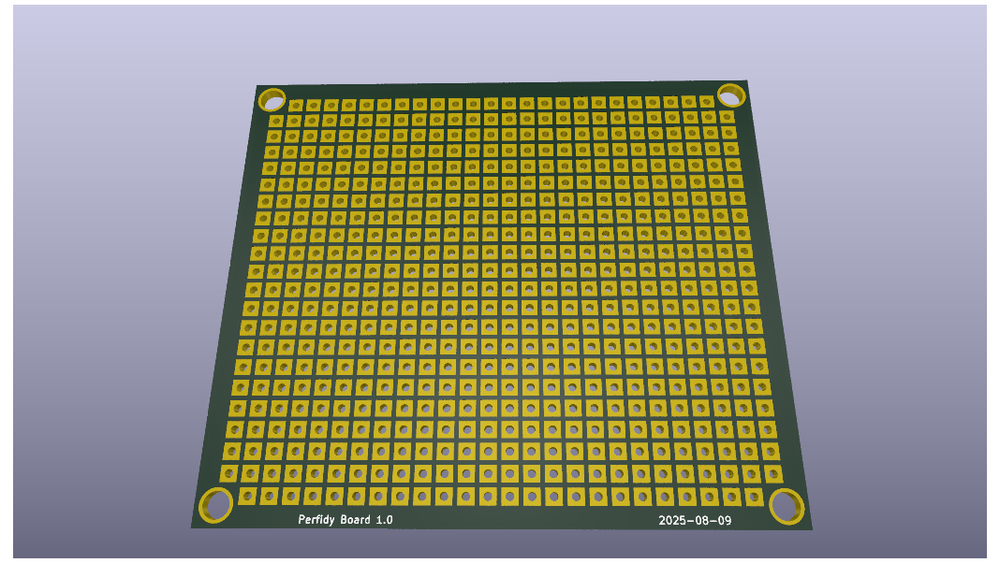
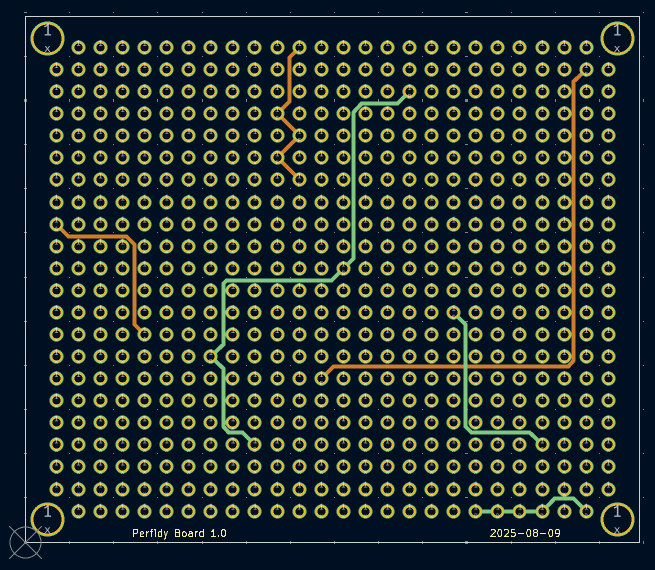

# perfidy-board
A truely diabolitcal perf board.

## Project Description
Generic perf board with a surprise mid-layer routing. I wouldn't wish this on my worst enemies!

## Manufacturing Note
If, for some godforesaken reason, you decide to produce this idiotic perf board, there are a few things you should be aware of:
1) I have never produced or tested it (Why would I??)
2) You need to select 4-layer manufacturing, which will be slightly more expensive than simple 2-layer boards. The board is set up with JLC PCB rules (but again, untested)
3) You will loose all of your friends